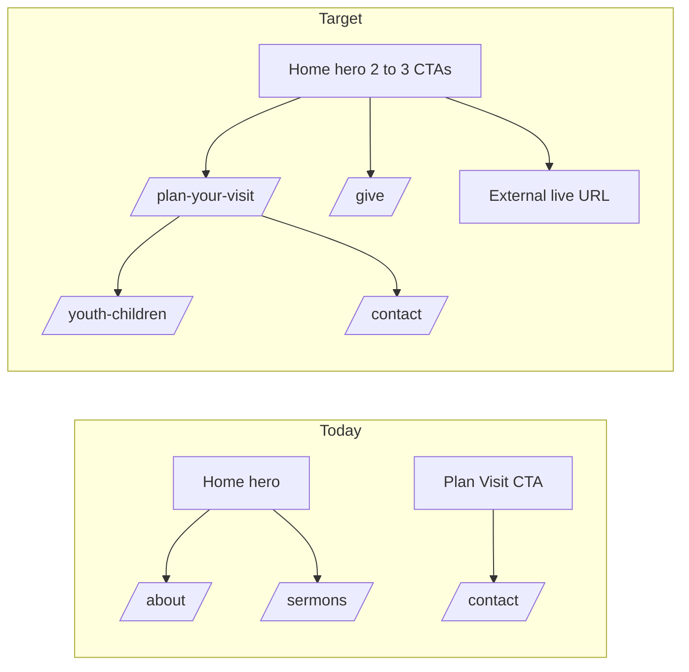

# Phased plan: essential church CTAs

## Overview

Roll out essential church CTAs in four phases: first-time visitor funnel and hero focus, then configurable live/app links, then prayer and ministry pathways, then events/RSVP polish—aligned with bilingual Firestore `churchInfo` and existing routes.

## Implementation checklist

- [ ] **Phase 1:** Add PlanYourVisit page + route, rewire Home Plan Visit CTA, tighten hero to 2–3 CTAs with specific copy, nav/footer + i18n + rules
- [ ] **Phase 2:** Extend churchInfo + AdminChurchInfo for liveStreamUrl and app URLs; hero/footer CTAs when set; optional VITE_ fallback + docs
- [ ] **Phase 3:** Contact `?tab=prayer`; ministry/get-involved pathways on Visit/About (or new Connect page)
- [ ] **Phase 4:** RSVP-focused labels on EventDetail/EventCard + admin helper text; optional per-event bilingual label fields

---

## Current baseline (what exists today)

- **Hero** (`src/pages/Home.jsx`): two actions — “Learn About Us” → `/about`, “Watch Sermons” → `/sermons`. Background video toggle is separate from a true “watch live” destination.
- **Plan Your Visit** (`src/i18n/en/translations.json` `home.planVisit`): the only visible use is a section CTA linking to **`/contact`**, which is a mismatch for first-time guest expectations (service times already appear above that button on Home).
- **Give** (`src/pages/Give.jsx`): route `/give` exists; not emphasized in the hero today.
- **Prayer** (`src/pages/Contact.jsx`): tabbed **Contact** vs **Prayer Request**; `submitPrayerRequest` in `src/services/contactService.js` writes to `prayerRequests`. No URL deep-link to open the prayer tab directly.
- **RSVP / registration** (`src/pages/EventDetail.jsx`): optional `event.registrationUrl` renders a primary button using `events.registerNow`. Admin field in `src/pages/admin/AdminEvents.jsx`. **Event cards** only show “Learn more” → detail (`src/components/ui/EventCard.jsx`).
- **Youth & Children**: `/youth-children` (`src/pages/YouthChildren.jsx`) — good anchor for “kids on Sunday” content but not yet framed as part of a visit journey.
- **Configurable church data**: `siteSettings/churchInfo` (`src/services/siteSettingsService.js`) via `src/pages/admin/AdminChurchInfo.jsx` — natural place for bilingual visitor copy and external URLs (live stream, App Store / Play Store) without new collections.

---

## Phase 1 — First-time visitor funnel and above-the-fold focus

**Goals:** Honor “2–3 primary actions” on Home; make **Plan Your Visit** honest and useful; tighten vague hero copy where it matters.

1. **Add a dedicated `PlanYourVisit` page** (e.g. `src/pages/PlanYourVisit.jsx`) and route in `src/App.jsx` (e.g. `/plan-your-visit`). Structure: page-hero + sections for **what to expect**, **service times** (reuse `churchInfo.serviceTimes` from `useSiteSettings`), **directions** (reuse maps pattern from Home), **children / youth** (short reassurance + link to `/youth-children`), **contact / questions** (link to `/contact`). Initial parking / FAQ copy can be **static bilingual strings** in translations, then moved to Firestore in Phase 2 if you prefer admin-editable text.
2. **Rewire CTAs:** Change Home “Plan Your Visit” from `Link to="/contact"` in `src/pages/Home.jsx` to the new route. Optionally add a compact secondary link to Contact from that page.
3. **Hero redesign (limit to 2–3 primaries):** Replace or demote one of the current two so the set matches growth priorities — e.g. **Plan Your Visit** + **Give** + **Watch Live** (Phase 2 URL) *or* **Plan Your Visit** + **Give** + keep **Watch Sermons** if live URL is not ready yet. Use **specific labels** (per your brief): e.g. swap “Learn About Us” for something outcome-oriented *or* move “About” to a text link / lower section so the hero stays uncluttered.
4. **Navigation & discoverability:** Add the new page to `src/components/layout/Navbar.jsx` (top-level or under **Connect**) and `src/components/layout/Footer.jsx` quick links; add **EN/AM** keys in `src/i18n/en/translations.json` and `src/i18n/am/translations.json`.
5. **Mobile:** Ensure hero button stack uses existing `.btn-lg` / spacing; verify tap targets ≥ ~44px in `src/index.css` for new hero groupings only if gaps appear.

**Rule maintenance:** Update `.cursor/rules/project-overview.mdc` (routing table) and `.cursor/rules/common-tasks.mdc` (new page checklist) after the route exists.

---

## Phase 2 — Live stream and app (configurable, optional when unset)

**Goals:** **Watch Live / Join Online** and **Download Our App** without hardcoding URLs in JSX.

1. **Extend `churchInfo` document** with optional fields, e.g. `liveStreamUrl`, `iosAppUrl`, `androidAppUrl` (strings). Add inputs to `src/pages/admin/AdminChurchInfo.jsx` and defaults in `src/contexts/SiteSettingsContext.jsx` `DEFAULT_CHURCH_INFO` if used.
2. **Surface CTAs when URLs exist:** Hero button (external, `target="_blank"` `rel` includes `noopener noreferrer`), and a **footer** or **end-of-home** strip for the app badges/links so the hero does not exceed 3 buttons (app can be secondary placement).
3. **Optional env fallback:** e.g. `VITE_LIVE_STREAM_URL` read in Home only if `churchInfo.liveStreamUrl` is empty — document in `.cursor/rules/project-overview.mdc` / `.env.example` if you add it.

No Firestore rule changes needed if these fields live on the already public-readable `siteSettings/churchInfo` doc.

---

## Phase 3 — Prayer and ministry / community pathways

**Goals:** Low-friction **Submit a Prayer Request** and clearer **Join a Small Group / Ministry** without bloating the hero.

1. **Deep link Contact tabs:** In `src/pages/Contact.jsx`, read `useSearchParams` — e.g. `/contact?tab=prayer` sets initial `activeTab` to `prayer`. Add links from Home footer strip, Plan Your Visit page, or a short “Pastoral care” blurb.
2. **Ministry / community hub (choose one scope):**
   - **Lightweight (recommended first):** A section on **Plan Your Visit** + **About** (end of page) with 2 cards: “**Get involved**” → `/contact` (optional `?subject=` or free-text note in the contact form later) and “**Youth & Children**” → `/youth-children`.
   - **Heavier (later):** New `/connect` page listing ministries with the same links; then add route + nav (same rule updates as Phase 1).

Keep **2–3 primary actions per page**; ministry entry should be secondary CTAs or inline links, not five equal buttons.

---

## Phase 4 — Events: RSVP visibility and copy

**Goals:** Align with “RSVP for seasonal programs” and reduce friction from list → action.

1. **Copy:** Add translation keys for **RSVP**-style button text (EN/AM) and use on `src/pages/EventDetail.jsx` instead of or in addition to `events.registerNow` (your choice: single string or `registrationLabel` / `registrationLabelAm` on the event document for per-event wording).
2. **Event cards:** If `registrationUrl` is set, show a secondary **RSVP** control on `src/components/ui/EventCard.jsx` (outline button) while keeping “Details” for narrative — avoids hiding RSVP behind one extra click for high-intent events.
3. **Admin hint:** In `src/pages/admin/AdminEvents.jsx`, clarify placeholder text: “RSVP / registration link (Eventbrite, Google Form, etc.).”

---

## Execution order and dependencies

| Phase | Depends on | Delivers |
|-------|------------|----------|
| 1 | — | Visit page, corrected Plan Visit CTA, focused hero, nav/i18n |
| 2 | Phase 1 hero layout settled | Live + app links from CMS |
| 3 | Phase 1 visit page | Prayer deep link, ministry pathways |
| 4 | — | Can run in parallel with 2–3 after Phase 1 if desired |

---

## Out of scope (unless you explicitly want them later)

- Building a native RSVP system in Firestore (current `registrationUrl` pattern is enough for most churches).
- Replacing external registration with in-app forms (larger product scope).
